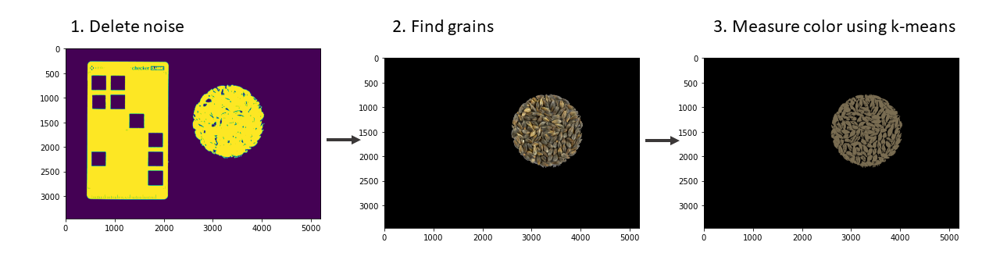
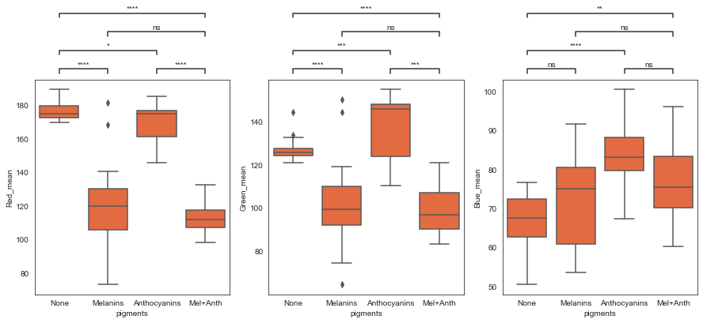
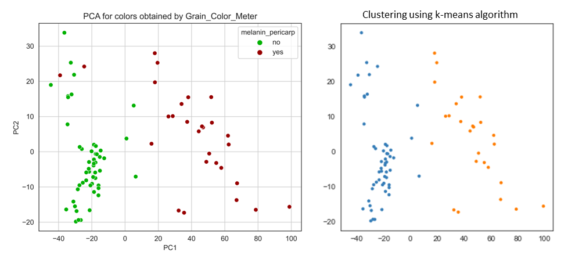

# Grain_Color_Meter
This tool performs the measurement of the color of grains. At the first step, it normalize image and separates objects from the background using Otsu's Thresholding. 
Then it removes all rectangular contours from the image (to remove the colorchecker from the image and leave only the grains). Then it measures the color using the k-
means algorithm.

  

## Installation
To install this package, download it from this GitHub page (Code -> Download zip) or clone this repository.

`git clone https://github.com/vikhall/Grain_Color_Meter.git`

### Requirements
This package requires: 
* Python 3.6.0 or higher;
* Biopython 1.79 or higher;
* xlwt 1.3.0 or higher.

## Usage
To use this script, import it in your script or Jupiter notebook.

`from Grain_Color_Meter import Grain_Color_Meter`

And then use the function measure_color.

`Grain_Color_Meter.measure_color(image, preproc_1 = True, preproc_2 = True, res_img='Yes', open_iter=2, bg_iter=4, k=2)`

## Implementation
This script was used to analyze dataset of barley grains. This dataset included photos of barley grains for 78 varieties. Each variety was photographed in 9 
repetitions. Barley with the Blp locus (melanin pigments, brown color) and with Myc2, Ant2 loci (anthocyanin pigments, blue and purple color) were present among the 
varieties. The purpose of the analysis were to distinguish colored (brown, blue and purple) varieties from not-colored ones using measurement of color from photos.

It was found that grains with melanins differ from uncolored grains in the red and green channels with p-value < 10e-4. Grains with anthocyanins differ from uncolored 
ones in the green and blue channel with p-value < 10e-3.

  

                                                                   
Also, the analysis of the main components and the cluster analysis of the measured colors were performed. The PCA plot shows that the separation by the first principal component almost completely coincides with the separation by the presence of melanin pigments (except of two outliers). Clustering also showed that the separation into clusters occurs by the presence of melanin pigments (сorrelation coefficient between cluster and pigments = 0.94).
 

  

                                                                      
Thus, this tool accurately measures the color of the grains. Using these measurements, it is possible to determine with high confidence whether anthocyanin or melanin pigments are present in the grain.
